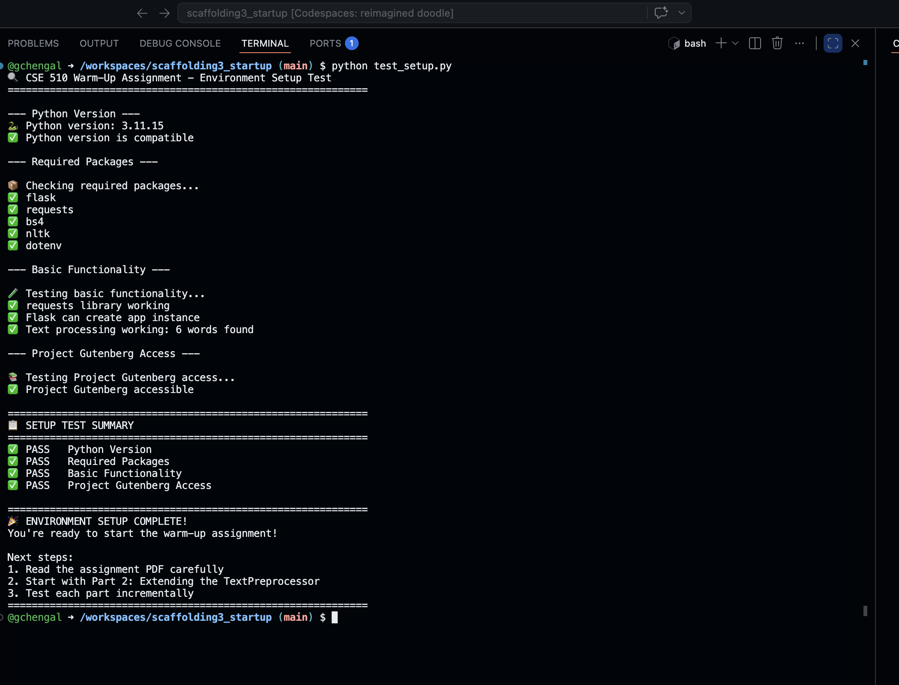
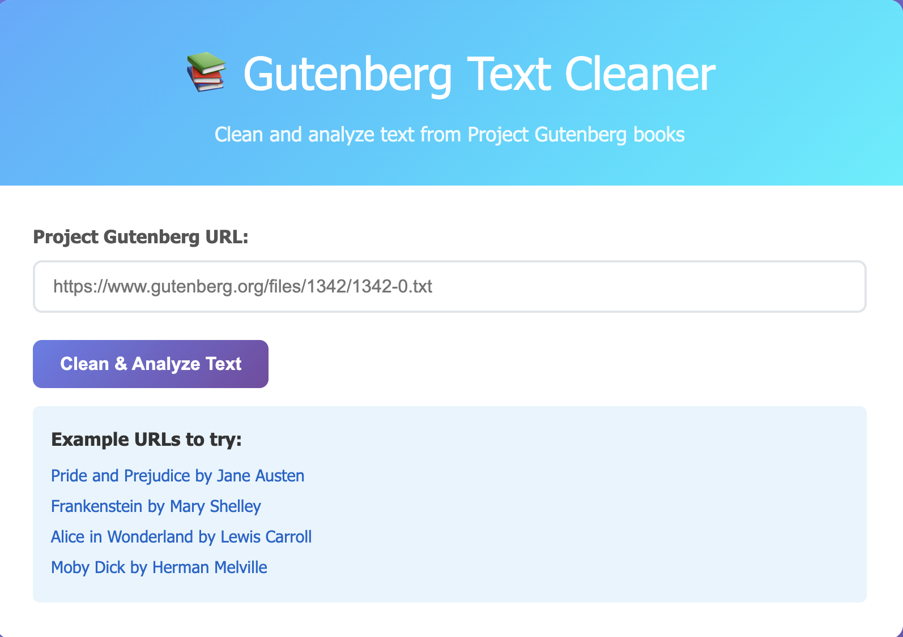
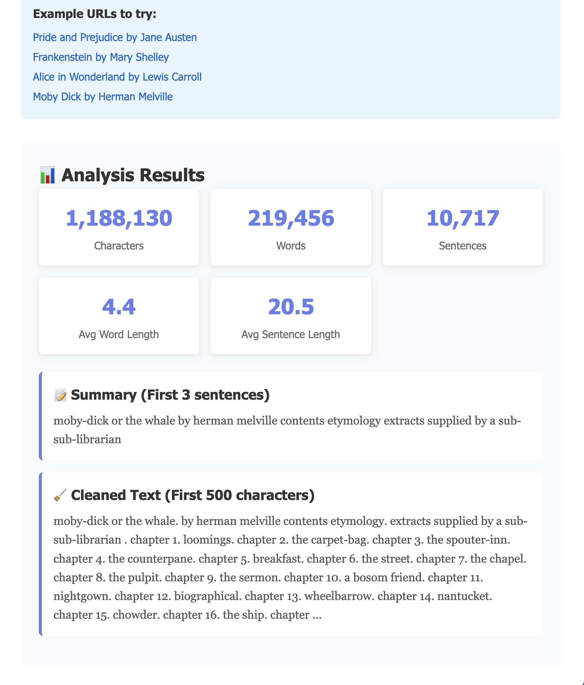



# Operational Assignment 3: Text Preprocessing Web Service

## Overview

This project is a "Hello World" for Natural Language Processing (NLP). It consists of a Flask-based web service that can fetch raw text from Project Gutenberg URLs, clean the text of legal headers/footers, and provide detailed linguistic statistics and a summary.

## Features

-   **URL Fetching:** Automatically retrieves .txt files from Project Gutenberg.
    
-   **Text Cleaning:** Removes boilerplate headers and footers to isolate the actual book content.
    
-   **Linguistic Analysis:**
    
    -   Total character, word, and sentence counts.
        
    -   Average word and sentence lengths.
        
    -   Identification of the top 10 most frequent words.
        
-   **Extractive Summarization:** Generates a 3-sentence summary using the start of the text.
    
-   **Responsive UI:** A clean web interface with loading states and error handling.
    

## Setup & Installation

### 1. Environment

This project is designed to run in **GitHub Codespaces** or a local Python environment (Python 3.9+).

### 2. Install Dependencies

Run the following command in your terminal to install Flask and the Requests library:

codeBash

```
pip install -r requirements.txt
```

### 3. Verify Environment

Run the setup test script to ensure all components are configured correctly:

codeBash

```
python test_setup.py
```

> Example: 

## Running the Application

To start the Flask server, run:

codeBash

```
python app.py
```

Once the server is running, open the provided local URL (usually http://127.0.0.1:5000) in your browser.

## Application Preview

### Main Interface

The user enters a Project Gutenberg .txt URL into the input field.

>

### Analysis Results

Once "Analyze" is clicked, the service displays the cleaned content, statistics, and summary.

>

## Project Structure

-   app.py: The Flask application containing API endpoints (/api/clean and /api/analyze).
    
-   starter_preprocess.py: The core TextPreprocessor class containing logic for fetching, cleaning, and statistics.
    
-   templates/index.html: The frontend interface built with HTML, CSS, and JavaScript (Fetch API).
    
-   requirements.txt: List of Python dependencies.
